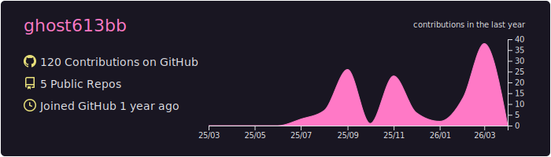

👨‍💻 **前端开发** | JavaScript Enthusiast | INFJ

---

- 💡 热爱前端开发，专注于 JavaScript 及相关技术栈
- 🛠️ 技能专长：JavaScript、前端工程化
- 🌱 立志深耕前端领域，持续学习 ing
- 🌎 腾讯犀牛鸟-cherrymarkdown 贡献者、腾讯大前端菁英班成员
- ☁️ 喜欢听歌、画画、冥想、清晨和夜晚

---

### 最喜欢的一句话：

- 🚀 I use daily:
  
  
  
  
  
  
  
  
  
  
  
  
  
  
  
  

- 💻 I work using:
  
  
  
  
  

	

		<!-- 
		
		
		 -->
		
	

    

	<picture>
		<source media="(prefers-color-scheme: dark)"  srcset="https://raw.githubusercontent.com/ghost613bb/ghost613bb/output/github-contribution-grid-snake-dark.svg" width="1000" />
		<source media="(prefers-color-scheme: light)" srcset="https://raw.githubusercontent.com/ghost613bb/ghost613bb/output/github-contribution-grid-snake.svg" width="1000" />
		
	</picture>

	<table>
		<tr>
			<td align="center">
				<picture>
				<source media="(prefers-color-scheme: dark)"  srcset="https://cdn.jsdelivr.net/gh/ghost613bb/ghost613bb/profile-3d-contrib/profile-night-rainbow.svg?clear=1" />
				<source media="(prefers-color-scheme: light)" srcset="https://cdn.jsdelivr.net/gh/ghost613bb/ghost613bb/profile-3d-contrib/profile-season-animate.svg?clear=1" />
				
				</picture>
			</td>
		</tr>
	</table>

